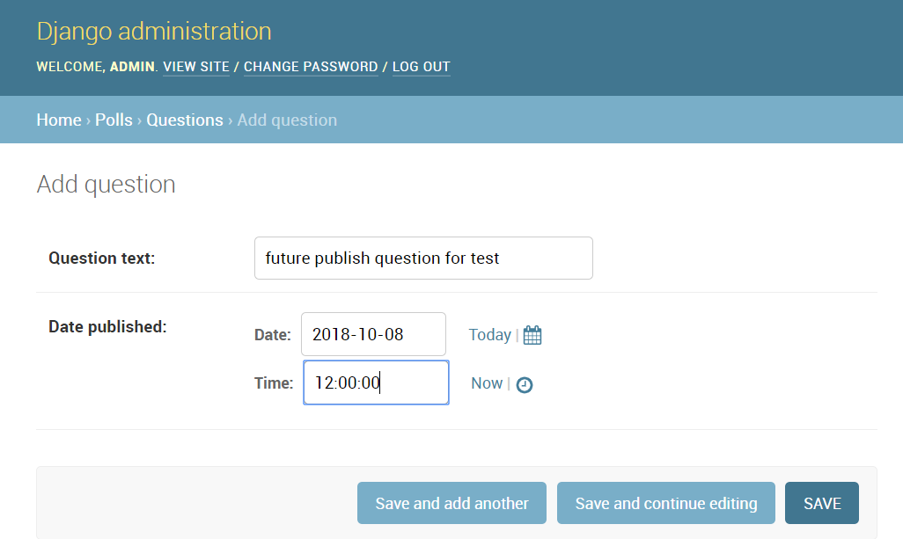
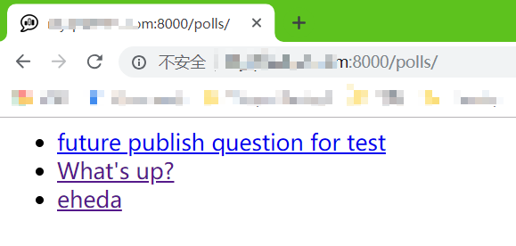
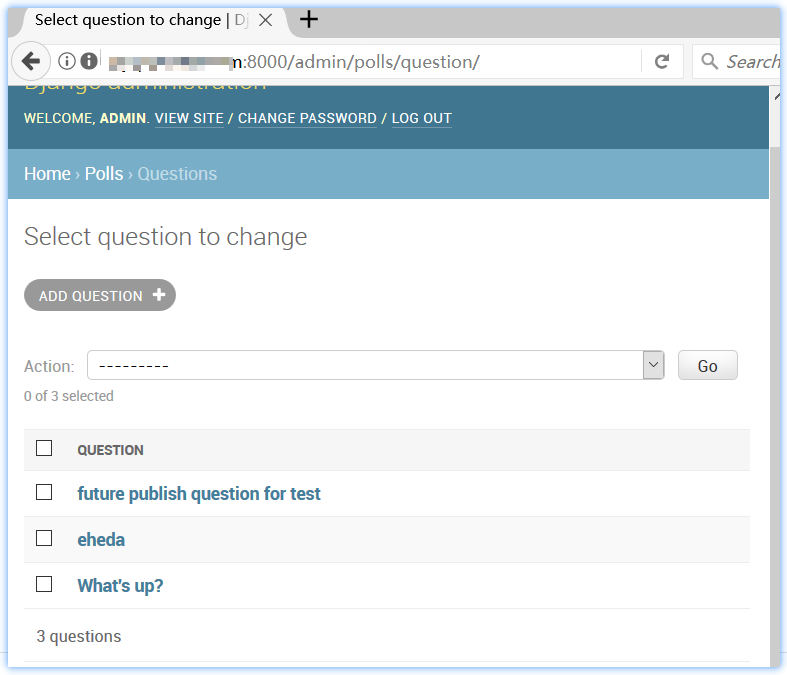
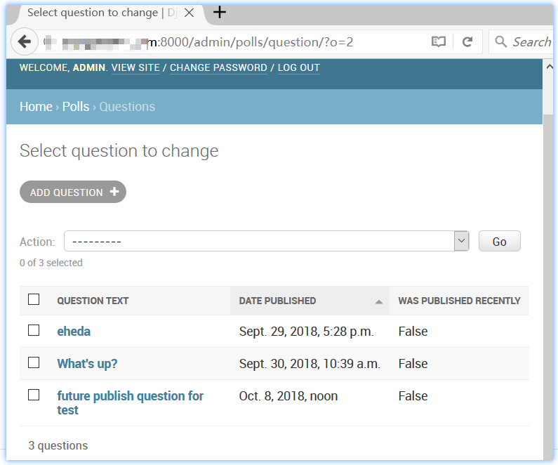

# README

  通过 Django 官方 Tutorial 练习 Django

## *Overview*

[TOC]

## Contents

  N/A

## Summary

N/A

## ToDo

- [x] 教程5 - django 的 “模块” 测试

## Note

n/a


## Change Log

### 教程2 - model & 数据库

1. 创建 models.py， 
2. 在 models.py 中创建 “数据模型”类（？） -- 数据库的表
3.  `$ python manage.py shell` 实践操作数据库 API


### 教程5 - django 的“单元”测试

创建了 `mysite/polls/test.py` 使用 `$ python manage.py test polls` 来运行测试。

```python
import datetime

from django.test import TestCase
from django.utils import timezone

from .models import Question


class QuestionModelTest(TestCase):
	def test_was_published_recently_with_future_question(self):
		"""
		was_published_recently() returns False for question 
		whose pub_date is in the future.
		"""
		time = timezone.now() + datetime.timedelta(days=30)
		future_question = Question(pub_date=time)
		self.assertIs(future_question.was_published_recently(), False)

```

这将暴露 Question 这个 model 的 was_published_recently() 这个函数的一个 bug ！


现在， 修复这个 bug

```python
### filename: polls/models.py
	def was_published_recently(self):
		now = timezone.now()
		return now - datetime.timedelta(days=1) <= self.pub_date <= now
    
```


上面修改了代码， 为了避免引入新的 bug， 完善/更全面的测试（原本 was_published_recently 函数的功能测试）。

```python
#### filename: polls/test.py
	def test_was_published_recently_with_old_question(self):
		"""
		was_published_recently() returns False for question
		whose pub_date is older than 1 day.
		"""
		time = timezone.now() - datetime.timedelta(days=1, seconds=1)
		old_question = Question(pub_date=time)
		self.assertIs(old_question.was_published_recently(), False)

	def test_was_published_recently_with_recent_question(self):
		"""
		"""
		time = timezone.now() - datetime.timedelta(hours=23, minutes=59, seconds=59)
		recent_question = Question(pub_date=time)
		self.assertIs(recent_question.was_published_recently(), True)	
        
```


#### 针对视图的测试

添加 发布时间定为 future 的 question:



index 页面确认添加 question 成功：



修改 views.py 

```python
class IndexView(generic.ListView):
    [...]
    def get_queryset(self):
		"""Return the last five published questions.
		not including those set to be published in the future
		"""
		return Question.objects.filter(
						pub_date__lte=timezone.now()
        			).order_by('-pub_date')[:5]
```


测试代码：

```python
### filename; polls/test.py
from django.urls import reverse

def create_question(question_text, days):
	"""
	"""
	time = timezone.now() + datetime.timedelta(days=days)
	return Question.objects.create(question_text=question_text, pub_date=time)


class QuestionIndexViewTest(TestCase):
	"""docstring for QuestionIndexViewTest"""
	
	def test_no_questions(self):
		response = self.client.get(reverse('polls:index'))
		self.assertEqual(response.status_code, 200)
		self.assertContains(response, 'No polls are available.')
		self.assertQuerysetEqual(response.context['latest_question_list'], [])

	def test_past_question(self):
		"""
		"""
		create_question(question_text="Future question.", days=30)
		response = self.client.get(reverse('polls:index'))
		self.assertContains(response, "No polls are available.")
		self.assertQuerysetEqual(response.context['latest_question_list'], [])

	def test_two_past_questions(self):
		"""
		"""
		create_question(question_text="Past question 1.", days=-30)
		create_question(question_text="Past question 2.", days=-5)
		response = self.client.get(reverse('polls:index'))
		self.assertQuerysetEqual(
			response.context['latest_question_list'],
			['<Question: Past question 2.>', '<Question: Past question 1.>'])


```

- [ ] 为什么 create_question() 函数有返回值，但是 testCase 的 function “看起来”并没有使用到其返回值，但是也能 work？


#### 测试 DetailView

问题： 如果在浏览器的 地址栏， 输入”正确“的 `url/polls/<id>/` ID, 也可以看到在 future 发布的 Question

在 DetailView 里增加一些约束：

```python
#### filename: polls/views.py

```


### 教程7 - 后台表单

一个 Question 应该有多个 Choice (还记的 detail 页面的 radio 吗)。但是后台没有显示多个选项。

有两种方法可以解决这个问题， 一是仿照向后台注册 Question 一样注册 Choice。

```python
### filename: polls/admin.py
[...]
from .models import Choice

admin.site.register(Choice)

```

这样就能在后台 admin 上添加 choice， 并且其会有一个 select 控件用于选择 Question，这就就将新添加的 choice 分配到了 该 Question 上。


但是因为上述方法太“僵硬”， 所以删除“注册“代码， 换一种方式。

这种方法就是在创建"Question" 投票对象的时候，直接添加好几个选项。

```python
### filename: polls/admin
from .models import Question, Choice

# admin.site.register(Choice)
class ChoiceInline(admin.StackedInline):
	model = Choice
	extra = 3

class QuestionAdmin(admin.ModelAdmin):
	fieldsets = [
		(None,               {'fields':['question_text']}),
		("Date Information", {'fields':['pub_date'],
							  'classes':['collapse'],
							  }),
	]
	inlines = [ChoiceInline]


admin.site.register(Question, QuestionAdmin)

```

这样就可以在 Question 的 添加/编译 后台页面 添加/编辑 其 Choice 了。

- [ ] `classes:['collapse']` 并没有体现出 Choice 相关的东西， 是哪一个点需要理解清楚？


#### 自定义后台更改列表

当前后台管理页面的 Question looks like:



默认情况下， Django 显示每个对象的 str() 返回的值。 但是还有一些信息也能一起显示出来就更好了， 比如 published date， was recently published? 


为此， 使用 list_display 后台选项， 

```python
### filename: polls/admin.py
[...]
	list_display = ('question_text', 'pub_date', 'was_published_recently')

```


修改后显示像这样：




